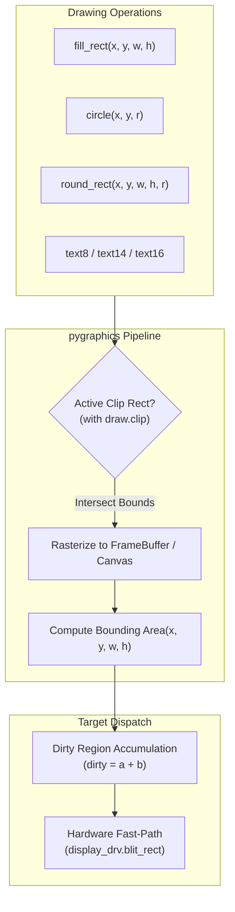

# Graphics guide

Cross-platform 2D drawing: framebuf-compatible buffers, shape primitives that return **Area** bounds, fonts, and image loaders. One import works on MicroPython, CircuitPython, and CPython.

!!! note "Where the pieces live"
    `pygraphics` is maintained here. Install it from the
    [PyDevices MIP index](installation.md) (`mip.install("pygraphics", index=…)`)
    or from TestPyPI as `pydevices-pygraphics`. The `utils` modules referenced
    below (`displaybuf`, `tft_text`, …) ship with
    [pydevices-examples](https://github.com/PyDevices/pydevices-examples).

## Quick start

```python
import pygraphics

w, h = 16, 16
fb = pygraphics.FrameBuffer(bytearray(w * h * 2), w, h, pygraphics.RGB565)
fb.fill(0)
fb.fill_rect(1, 1, 6, 6, 0xFFFF)
fb.circle(8, 8, 3, 0x1234)
pygraphics.text8(fb, "Hi", 0, 0, 0xFFFF)
```

`pygraphics` bundles its own pure-Python `framebuf` implementation (`pygraphics.framebuf`, MP-parity
with `modframebuf.c`) and always builds `pygraphics.FrameBuffer` on top of it — the same code path
runs on MicroPython, CircuitPython, and CPython, so there is no native-vs-pure-Python backend to
inspect or branch on.

## Drawing Pipeline Architecture



## FrameBuffer vs Draw vs module functions

| Style | When to use |
|-------|-------------|
| **`pygraphics.FrameBuffer`** | Default — own a buffer; get `.buffer`, `.width`, save/load, all shape methods |
| **`pygraphics.Draw(canvas)`** | Draw on a display driver or third-party object with `pixel` / `hline` / … |
| **Module functions** (`pygraphics.circle(fb, …)`) | Short scripts; same primitives as `FrameBuffer` methods |

```python
draw = pygraphics.Draw(display_drv)
draw.round_rect(5, 5, 50, 30, 4, 0xF800)

with draw.clip(10, 20, 100, 60):
    draw.fill_rect(0, 0, 200, 200, 0xF800)  # only the intersection is drawn
```

## Area and partial updates

Most draw methods return an `Area(x, y, w, h)` bounding box. Union dirty regions:

```python
a = fb.fill_rect(0, 0, 10, 10, color)
b = fb.circle(12, 12, 4, color)
dirty = a + b
display_drv.blit_rect(fb.buffer, dirty.x, dirty.y, dirty.w, dirty.h)
```

- **Setting** `fb.pixel(x, y, c)` returns `Area(x, y, 1, 1)`.
- **Reading** `fb.pixel(x, y)` returns the color (no `Area`).
- **`scroll()`** returns the full buffer bounds.

## Pixel formats

| Constant | Depth |
|----------|-------|
| `MONO_VLSB`, `MONO_HLSB`, `MONO_HMSB` | 1 bpp |
| `GS2_HMSB` | 2 bpp |
| `GS4_HMSB` | 4 bpp |
| `GS8` | 8 bpp |
| `RGB565` | 16 bpp |

## Fonts

Text helpers (`text8`, `text14`, `text16`, `text`, and `FrameBuffer.text`) use **embedded
romfont** data shipped inside the `pygraphics` package (`_font_8x8.py`, `_font_8x14.py`,
`_font_8x16.py` — derived from [spacerace/romfont](https://github.com/spacerace/romfont)).
No font files on the filesystem are required for the built-in heights.

```python
pygraphics.text8(fb, "Hello", 0, 0, 0xFFFF)
pygraphics.text14(fb, "Tall", 0, 16, 0xF800)
pygraphics.text16(fb, "Big", 0, 32, 0x07E0)
```

### Loading romfont `.bin` files from the filesystem

To use a custom or packaged romfont binary, pass a **file path** to `pygraphics.Font`.
The file is opened on MicroPython, CircuitPython, and CPython like any other readable path
(relative paths are resolved from the process working directory).

```python
f = pygraphics.Font("assets/font_8x14.bin", 14)
f.text(fb, "From disk", 0, 48, 0xFFFF)

# Height can be inferred from names like font_8x16.bin when omitted:
f16 = pygraphics.Font("/sd/fonts/font_8x16.bin")
```

By default (`cached=True`) the entire file is read into RAM when the `Font` is constructed.
Set `cached=False` to keep the file open and read glyphs on demand (lower RAM, more I/O).

Missing or unreadable paths raise `FileNotFoundError`. A file whose size does not match the
expected glyph count raises `RuntimeError`.

Examples that load `.bin` fonts from disk: `font_simpletest.py` (cycles
`string_blit` → `per_pixel` → `displaybuf`) and `font_list.py`. Both read font
files from the filesystem, so they run on desktop and MCU but not in the
browser.

For a `Font` demo you can run right now, see
[`tv_remote_menu.py`](https://pydevices.github.io/pydevices-examples/gallery/pyodide.html?modules=tv_remote_menu&deps=pydevices-pygraphics) or
[`pydevices_demo.py`](https://pydevices.github.io/pydevices-examples/gallery/pyodide.html?modules=pydevices_demo&deps=pydevices-pygraphics),
which use the built-in font (`Font(height=16)`) and need no font file.

### Romfont `.bin` format

Romfont binaries are a flat blob of glyph rows (8 pixels wide, MSB = leftmost pixel):

| Field | Value |
|-------|--------|
| Glyph order | Code points `0`–`255` (or `128` glyphs for a 128-character subset) |
| Bytes per glyph | Font height (e.g. 8, 14, or 16) |
| File size | `256 × height` bytes, or `128 × height` for 128-glyph files |
| Width | 8 pixels (only 8-pixel-wide fonts are supported today) |

You can also pass a `memoryview` or `bytes` object instead of a path when the font data is
already in RAM (frozen module, `bytes` literal, mmap, and so on).

### Not the same as `framebuf.text`

`pygraphics.framebuf.FrameBuffer.text()` (and MicroPython's built-in `framebuf` module) use a
**different** built-in 8×8 font (Damien George's `font_petme128_8x8`). For romfont appearance
and heights 8/14/16, use `pygraphics.text8` / `text14` / `text16` or `pygraphics.Font` as above.

### Choosing a font rendering pattern

`Font.text()` and `text8` / `text14` / `text16` render each set glyph bit with
`fill_rect` (scaled squares). **Where** you draw — and whether you composite in RAM first —
controls transparency, RAM use, and how much data hits the panel bus.

The multipath `font_simpletest.py` example uses the same `Font` + romfont `.bin` files but
cycles different targets in one run. [`pydevices_demo`](https://pydevices.github.io/pydevices-examples/gallery/pyodide.html?modules=pydevices_demo&deps=pydevices-pygraphics) follows the
**string framebuffer + one blit** pattern (`string_blit`).

| Pattern | Example | Background | Extra RAM | What hits the display | Typical sweet spot |
|---------|---------|------------|-----------|----------------------|-------------------|
| **Module helpers on canvas** | `pygraphics.text8(display_drv, …)` | Transparent (foreground pixels only) | None | One small `fill_rect` per lit pixel | Short labels, minimum RAM |
| **String FB → one blit** | `font_simpletest.py` (`string_blit`) | **Opaque** — `fb.fill(bg)` before `font.text` | One buffer sized to the string (reusable slice is better; see pydevices_demo) | **One** `blit_rect` per string | Desktop/SDL (batch then `show()`), SPI panels when RAM is tight |
| **Draw on `display_drv`** | `font_simpletest.py` (`per_pixel`) | Transparent | None | One `fill_rect` per lit pixel on the live driver | Simplest code path; **slowest** on MCU and desktop |
| **Full-screen `DisplayBuffer` + dirty blit** | `font_simpletest.py` (`displaybuf`) | Transparent over existing buffer contents | **Full panel** `DisplayBuffer` | `display.show(dirty)` — one row `blit_rect` per dirty scanline | MCUs with enough RAM; many text updates; fastest of the three modes |
| **Catalog / inspect fonts** | `font_list.py` | Opaque row buffer | One strip `width × height` per font | One `blit_rect` per font row | Browsing `.bin` files on disk |

#### Module helpers (`text8`, `text14`, `text16`)

Draw directly on any canvas (`FrameBuffer`, `display_drv`, `DisplayBuffer`, …). Only
foreground pixels are written — the background is left unchanged (**transparent** text).

```python
pygraphics.text8(fb, "Hi", x, y, fg_color)
area = pygraphics.text16(display_drv, "Status", 4, 4, 0xFFFF)  # returns Area bounds
```

Lowest memory overhead; fine for a few characters. On SPI TFTs without a compositing layer,
each lit pixel can become a separate bus transaction (same cost class as `per_pixel` mode).

#### String framebuffer + one blit (`string_blit`)

Compose the whole string in a small off-screen `FrameBuffer`, then upload it once:

```python
w, h = len(s) * font.width * scale, font.height * scale
buf = bytearray(w * h * 2)
fb = pygraphics.FrameBuffer(buf, w, h, pygraphics.RGB565)
fb.fill(bg_color)          # opaque background
font.text(fb, s, 0, 0, fg_color, scale)
display_drv.blit_rect(buf, x, y, w, h)
display_drv.show()         # SDL/pygame: present the frame
```

- **Opaque** labels (background colour filled before glyphs).
- **RAM:** proportional to string size, not the full screen — good when `DisplayBuffer` is too
  large for the MCU.
- **Speed:** one bulk blit per string. On **desktop** backends that defer work until `show()`,
  this batches well. On **MCU** panels that flush each `blit_rect` immediately, this still beats
  per-pixel drawing because the bus sees one contiguous block per string.
- Production apps often keep a **reusable** buffer sized for the longest line (see
  [`pydevices_demo`](https://github.com/PyDevices/pydevices-examples/blob/main/lib/examples/pydevices_demo.py)) instead of allocating every frame like the
  simpletest does.

#### Direct draw on `display_drv` (`per_pixel`)

```python
font.text(display_drv, s, x, y, fg_color, scale)
display_drv.show()
```

- **Transparent** text (no `fb.fill`; unset bits are not drawn).
- **Lowest RAM** — no extra framebuffer.
- **Slowest** upload pattern: every lit pixel is its own `fill_rect` on the driver. Avoid for
  long strings on hardware; acceptable for occasional tiny overlays.

#### `DisplayBuffer` + dirty rectangle (`displaybuf`)

Keep a logical full-screen buffer in RAM; upload only what changed:

```python
from displaybuf import DisplayBuffer

display = DisplayBuffer(display_drv)
dirty = font.text(display, s, x, y, fg_color, scale)
display.show(dirty)       # row blits for the Area bounds only (RGB565)
display_drv.show()          # present on SDL; on raw SPI may follow panel habits
```

- **Transparent** over whatever is already in the `DisplayBuffer`.
- **Highest RAM** (full panel buffer) — trade memory for speed when the UI redraws text often.
- **Fastest** of the three `font_simpletest` modes: glyph work stays in RAM; the panel receives only
  the dirty region (scanline `blit_rect`s), not per-pixel fills.
- Requires `utils/displaybuf.py` on the import path — set `PYTHONPATH`/`MICROPYPATH` to `.:lib:utils` (preferred), or see [pydevices install workflows](https://github.com/PyDevices/pydevices/blob/main/docs/install-workflows.md) when environment variables are unavailable or not set as recommended.
- Partial `area=` updates apply to **RGB565** `DisplayBuffer`; GS8/GS4 paths currently refresh
  wider bands (see `displaybuf` notes in source).

#### Desktop vs MCU and `display_drv.show()`

| Backend | Role of `show()` |
|---------|------------------|
| **SDL / pygame (desktop)** | Drawing is buffered; `show()` presents the frame. Prefer **few large blits** (`font_simpletest.py` or reusable string buffer) then one `show()` per frame. |
| **SPI / parallel MCU panels** | Many drivers act on each `blit_rect` / `fill_rect` immediately. Favour **one blit per string** or **`DisplayBuffer.show(dirty)`** over `font.text(display_drv, …)`. |
| **Skipping `show()`** | Only safe when your driver documents immediate updates. Per-pixel `font.text(display_drv, …)` is still slow on the bus even without `show()`. |

Run the examples side by side from `lib/`:

```bash
micropython examples/font_simpletest.py
```

PyScript and the gallery load the same `.bin` assets from `lib/examples/assets/` (see the
[pydevices-examples gallery](https://pydevices.github.io/pydevices-examples/gallery/)).

## Image loaders

Eager loaders in the `pygraphics` package (full image in RAM):

```python
fb = pygraphics.bmp_to_framebuffer("sprite.bmp")
fb = pygraphics.pbm_to_framebuffer("icon.pbm")
fb = pygraphics.pgm_to_framebuffer("gray.pgm")
fb = pygraphics.load_image("image.bmp")  # or FrameBuffer.from_file(...)
```

`save_image(fb, path)` and `FrameBuffer.save()` write PBM/PGM/BMP for the formats in [Graphics files](graphics-files.md). Other framebuffer formats raise `ValueError`.

## Blit fast paths

`pygraphics.blit()`, `Draw.blit()`, and `blit_rect()` dispatch to faster implementations when available:

| Destination | Fast path |
|-------------|-----------|
| Display driver (`blit_rect` / `blit_transparent`) | SPI/SDL/pygame bulk copy |
| `FrameBuffer` | `pygraphics.framebuf`'s `blit()` (same implementation on every interpreter) |

Use `Draw(display_drv).blit(sprite_fb, x, y)` instead of a per-pixel loop — it routes to `display_drv.blit_rect` for RGB565 sprites.

### Clip regions

`Draw.clip(x, y, w, h)` (or `clip(Area(...))`) is a context manager that intersects all drawing with a rectangle. Nested clips intersect further; the clip is restored when the block exits:

```python
with draw.clip(10, 10, 50, 40):
    draw.fill(0x0000)          # fills only the clip rect
    draw.text8("Panel", 0, 0, 0xFFFF)
```

For streaming/large BMP assets, use `pygraphics.BMP565` (sliceable, optional streaming reads) — see [Graphics files](graphics-files.md).

## 🎮 Live Interactive Gallery Examples

Run full interactive `pygraphics` games and demos directly in your browser:

| Example | Description | Live PyScript Link |
|:---|:---|:---|
| **`bouncing_balls`** | Animated high-framerate vector bouncing balls | [**Launch `bouncing_balls`**](https://pydevices.github.io/pydevices-examples/gallery/pyodide.html?modules=bouncing_balls&deps=pydevices-pygraphics) |
| **`alien`** | Animated retro sprite invasion arcade | [**Launch `alien`**](https://pydevices.github.io/pydevices-examples/gallery/pyodide.html?manifests=alien&deps=pydevices-palettes,pydevices-pygraphics) |
| **`calc_graphics`** | Pure 2D graphics pocket calculator | [**Launch `calc_graphics`**](https://pydevices.github.io/pydevices-examples/gallery/pyodide.html?modules=calc_graphics,calc_engine&deps=pydevices-palettes,pydevices-pygraphics) |
| **`dino`** | Chrome runner obstacle jumping arcade | [**Launch `dino`**](https://pydevices.github.io/pydevices-examples/gallery/pyodide.html?modules=dino&deps=pydevices-pygraphics) |
| **`simon`** | Simon touch memory sequence game | [**Launch `simon`**](https://pydevices.github.io/pydevices-examples/gallery/pyodide.html?modules=simon&deps=pydevices-pygraphics) |
| **`piano`** | Interactive multi-key musical keyboard | [**Launch `piano`**](https://pydevices.github.io/pydevices-examples/gallery/pyodide.html?modules=piano&deps=pydevices-pygraphics) |
| **`testris`** | Complete falling-blocks arcade game | [**Launch `testris`**](https://pydevices.github.io/pydevices-examples/gallery/pyodide.html?modules=testris&deps=pydevices-pygraphics) |
| **`rotations`** | Hardware and software panel rotation suite | [**Launch `rotations`**](https://pydevices.github.io/pydevices-examples/gallery/pyodide.html?modules=rotations&deps=pydevices-palettes,pydevices-pygraphics) |

---

## FAQ

**Draw method returned nothing?** — Use `pygraphics.FrameBuffer` or `Draw`; the bare `pygraphics.framebuf.FrameBuffer` base methods do not return `Area`.

## Next

- [Graphics files](graphics-files.md) — loaders and BMP565
- [API overview](api-overview.md)
- [Displays](https://github.com/PyDevices/pydevices/blob/main/docs/displaydev.md)
